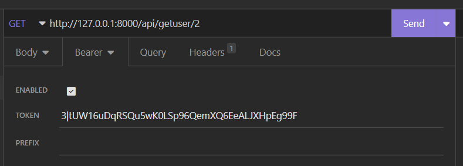

# U06 Receptapp

Denna uppgift handlar om att bygga en receptapp som tillåter användaren att söka på recept och filtera resultat och (för VG) spara recept som man gillar i olika listor. Både backend och frontend av applikationen ska deployas och kopplas ihop så att de fungerar tillsammans. 

## Bekanta er:

I denna uppgift ska ni bekanta er med RecipeAPI, ett projekt skrivet i PHP/Laravel. 

Bekanta er genom att läsa igenom koden, få igång programmet med bland annat migrationer, seeding och serving. 

Några steg:

1. Kör igång devcontainern och gå sedan in i terminalen och cd in i rätt mapp.
2. Kör `composer update`
3. Ändra .env.example filen till .env
4. Kör `php artisan key:generate`
5. Kör `php artisan migrate` (skapa databasen)
6. Kör `php artisan db:seed`
7. Kör `php artisan serve`

Testa sedan de olika requesten du får tillgång till genom att importera filen: "Insomnia_U06_requests.json" till er Insomnia klient. Ni kan behöva registrera till Insomnia (t.ex. med Github kontot) för att kunna importera en fil.

När ni testar API:et kommer ni att behöva plocka ut de bearer tokens ni får vid inlogg eller registrering och klistra in i Bearer fältet för att kunna få åtkomst till de API vägar som ligger bakom authentication.

När ni fått backenden att fungera och ni känner att ni grundläggande förstår er på koden så behöver ni inte göra något mer här vid detta tillfälle. Låt appen ligga och köra i bakgrunden med php artisan serve och fokusera nu istället på att bygga er frontend. 

## Bygga Frontend

Ni ska nu fokusera på att skapa en frontend i Angular (utanför er devcontainer, t.ex. i ett annat VSCode fönster) som ska låta er *söka efter och filtrera olika recept med hjälp av ett externt API* såsom [edaman API](https://developer.edamam.com/edamam-docs-recipe-api) eller [spoonacular API](https://spoonacular.com/food-api) (ni kommer att behöva registrera er för att få tillgång till API:et).

Ni ska också koppla ihop erat frontend med RecipeAPI backenden. Skapa en sida för den inloggade användaren och tillåt användaren att logga in och logga ut.

## Deployment

När frontenden är färdig ska ni deploya både frontend (på e.g. [netlify](https://www.netlify.com/)) och backend (på e.g. Vercel eller Render). Väl i produktion ska dessa kopplas ihop så att de fungerar harmoniskt tillsammans. 

## Utöka frontend och backend (VG)

För att få VG på den här uppgiften så ska ni utöka programmet så att användare kan spara recept de gillar i olika listor. T.ex. kanske en användare vill ha en lista för bbq, en för soppor och en lista för vegansk mat. Ni ska då lägga till nödvändiga delar för att åstadkomma detta i backend och frontend inklusive controllers och routes i backend, och extra komponenter, vyer och services i frontend (samt ändringar i tidigare delar där det behövs). Backend programmet är säkert inte heller perfekt, förbättringar för gärna läggas in där också om ni hittar några. 

Ännu fler extra detaljer får gärna läggas till i mån av tid och för att helt försäkra sitt VG, t.ex. förbättringar i redan existerande kod, ett snyggt UX/UI samt kopplingar till fler API:er.

## Mer info:

Mer info går att hitta i uppgiftsbeksrivningen i Canvas.

Lycka till! 

 

## ENGLISH 

# U06 Recipe App

This task involves building a recipe app that allows users to search for recipes and filter results, and (for VG - Very Good grade) save recipes they like in different lists. Both the backend and frontend of the application should be deployed and connected so they function together.

## Get Familiar:

In this task, you will get familiar with RecipeAPI, a project written in PHP/Laravel.

Get familiar by reading through the code, setting up the program including migrations, seeding, and serving.

Some steps:

1. Start the dev container and then navigate to the terminal and cd into the correct folder.
2. Run `composer update`.
3. Change the .env.example file to .env.
4. Run `php artisan key:generate`.
5. Run `php artisan migrate` (to create the database).
6. Run `php artisan db:seed`.
7. Run `php artisan serve`.

Then test the various requests you have access to by importing the file: "Insomnia_U06_requests.json" into your Insomnia client. You may need to register with Insomnia (e.g., using your Github account) to be able to import a file.

When testing the API, you will need to extract the bearer tokens you receive upon login or registration and paste them into the Bearer field to access the API routes that require authentication.

Once you have the backend working and you feel you have a basic understanding of the code, you don't need to do anything more here at this point. Let the app run in the background with `php artisan serve` and focus now on building your frontend.

## Building Frontend

You will now focus on creating a frontend in Angular (outside your dev container, e.g., in another VSCode window) that will allow you to *search for and filter various recipes using an external API* such as [Edaman API](https://developer.edamam.com/edamam-docs-recipe-api) or [Spoonacular API](https://spoonacular.com/food-api) (you will need to register to access the API).

You should also connect your frontend to the RecipeAPI backend. Create a page for the logged-in user and allow the user to log in and log out.

## Deployment

Once the frontend is ready, deploy both frontend (e.g., on [Netlify](https://www.netlify.com/)) and backend (e.g., on Vercel or Render). Once in production, these should be connected so they work harmoniously together.

## Expand Frontend and Backend (VG - Very Good)

To achieve a VG grade on this task, you should expand the program so that users can save recipes they like in different lists. For example, a user might want a list for BBQ, one for soups, and one for vegan food. You should then add necessary parts to accomplish this in both backend and frontend, including controllers and routes in the backend, and extra components, views, and services in the frontend (as well as changes in previous parts where necessary). The backend program is probably not perfect either, so feel free to make improvements there too if you find any.

Even more additional details are welcome if time allows and to fully ensure your VG, such as improvements in already existing code, a polished UX/UI, and connections to more APIs.

## More Info:

More information can be found in the assignment description in Canvas.

Good luck!
